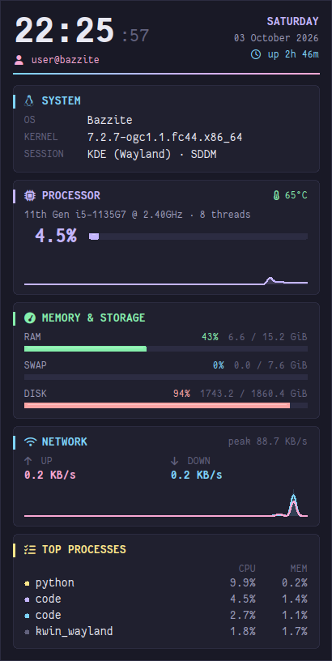

# pySysMon

A lightweight, Conky-style system monitor widget for the Linux desktop, written in a single Python file. Built for **Bazzite OS** (Fedora Atomic) on KDE Plasma, and works on other X11/XWayland desktops too.

<p align="center">
  
</p>


-191926?style=flat-square&logo=linux&logoColor=white)


## Features

- **Lives on the desktop:** the widget always stays *below* other windows, has no title bar or border, and doesn't appear in the taskbar, pager or Alt+Tab.
- **Clock & identity:** large clock, date, uptime, `user@host`, OS, kernel, and desktop session.
- **Processor:** model, thread count, live load bar, a 60-second load graph, and colour-coded temperature.
- **Memory & storage:** RAM, swap, and disk usage bars that turn yellow, then red, as they fill. Disk usage is read correctly on ostree systems such as Bazzite.
- **Network:** live upload and download speeds with a 60-second graph.
- **Top processes:** the four busiest processes by CPU, with CPU and memory percentages.
- **Polished look:** "Midnight Ink" theme (`#191926`), rounded cards, a gradient divider, Nerd Font icons and antialiased Fantasque Sans Mono text.
- **Lightweight:** one Python file. The only optional dependency is `psutil`; without it the widget reads `/proc` directly.
- **Terminal mode:** a `--cli` mode for SSH sessions or desktops without a GUI.

## Requirements

| Requirement | Notes |
|---|---|
| Linux with an X11 or XWayland session | Tested on Bazzite (KDE Plasma 6, Wayland via XWayland) |
| Python 3.10+ with `tkinter` | Tk **must be built with Xft**. Without Xft, text renders in blocky bitmap fonts (see [Troubleshooting](#troubleshooting)) |
| `psutil` *(optional)* | Enables CPU load, swap and top processes |
| [Fantasque Sans Mono Nerd Font](https://www.nerdfonts.com/font-downloads) | Installed automatically by `install.sh` |
| `conda` / Miniforge *(recommended)* | The installer uses it to create a Python env with Xft-enabled Tk |

> **Why conda?** Bazzite's system Python ships without `tkinter`, and the Tk builds bundled with Anaconda and `uv`'s Python lack Xft. conda-forge publishes an Xft-enabled Tk build (`tk=*=xft_*`), which gives smooth, antialiased fonts without modifying the immutable base system.

## Installation

### Quick install (recommended)

```bash
git clone https://github.com/y-v-j/pySysMon.git
cd pySysMon
./install.sh
```

Everything is installed in your home directory, so no root access or `rpm-ostree` layering is needed. The installer:

1. Installs **Fantasque Sans Mono Nerd Font** to `~/.local/share/fonts/` (skipped if it's already installed).
2. Sets up Python:
   - **conda found:** creates (or reuses) a conda env named **`conky-env`** with Python 3.12, an Xft-enabled Tk, and `psutil`.
   - **No conda:** creates a venv from a system Python that has `tkinter`. It warns you if that Tk lacks Xft.
3. Copies the app to `~/.local/share/pysysmon/` and writes a `launch.sh` launcher. The launcher uses a lock file so only one widget runs at a time.
4. Registers the widget to start at login (see [Start at login](#start-at-login)) and launches it.

#### Installer options

```text
./install.sh [--startup autostart|systemd|none] [--python PATH] [--no-start] [--uninstall]

  --startup MODE   How to launch at login: autostart (default), systemd, none
  --python PATH    Use a specific Python interpreter (must have tkinter)
  --no-start       Don't launch the widget after installing
  --uninstall      Remove the app and its startup entries
```

Set `PYSYSMON_CONDA_ENV=<name>` to use a different conda env name.

### Manual installation

```bash
# 1. Font
mkdir -p ~/.local/share/fonts/FantasqueSansMNerdFont
curl -fsSL https://github.com/ryanoasis/nerd-fonts/releases/latest/download/FantasqueSansMono.tar.xz \
  | tar -xJ -C ~/.local/share/fonts/FantasqueSansMNerdFont
fc-cache -f

# 2. Python env with an Xft-enabled Tk
conda create -n conky-env -c conda-forge --override-channels "python=3.12" "tk=8.6.*=xft_*" psutil

# 3. App
mkdir -p ~/.local/share/pysysmon
cp pysysmon.py ~/.local/share/pysysmon/

# 4. Run
"$(conda info --base)/envs/conky-env/bin/python" ~/.local/share/pysysmon/pysysmon.py
```

## Usage

| Action | Command |
|---|---|
| Start the widget | `~/.local/share/pysysmon/launch.sh` |
| Terminal (CLI) mode | `~/.local/share/pysysmon/launch.sh --cli` |
| Stop the widget | `pkill -f ~/.local/share/pysysmon/pysysmon.py` |
| Restart the systemd service | `systemctl --user restart pysysmon` |

Running `launch.sh` again while the widget is up does nothing, because the single-instance lock blocks it.

### Customising

All settings are constants at the top of [`pysysmon.py`](pysysmon.py):

| Setting | Default | Description |
|---|---|---|
| `POSITION` | `"top-right"` | `top-right`, `top-left`, `bottom-right`, `bottom-left` |
| `OFFSET_X`, `OFFSET_Y` | `24` | Distance from the screen edges (px) |
| `WINDOW_WIDTH` | `410` | Widget width (px). The height fits the content automatically |
| `WINDOW_OPACITY` | `0.96` | Window opacity, `0.0`–`1.0` |
| `FONT_CANDIDATES` | Fantasque Nerd Font, … | The first installed family is used. Icons appear only with a Nerd Font |
| `FONT_PX` | `15` | Base text size in pixels |
| `REFRESH_RATE_MS` | `1000` | Update interval |
| `HISTORY_LEN` | `60` | Samples kept for the CPU and network graphs |
| `COLOR_*` | Midnight Ink | Theme colours (`COLOR_BG = "#191926"`) |

After editing, re-run `./install.sh` (or copy the file to `~/.local/share/pysysmon/`) and restart the widget.

## Start at login

The installer sets this up for you. Choose one method; the installer switches cleanly between them.

### Option A: XDG autostart (default; KDE Plasma, GNOME and others)

```bash
./install.sh --startup autostart
```

This installs [`pysysmon.desktop`](pysysmon.desktop) to `~/.config/autostart/`. To set it up by hand:

```bash
mkdir -p ~/.config/autostart
cp pysysmon.desktop ~/.config/autostart/
```

On KDE Plasma you can also manage it in **System Settings → Autostart**.

### Option B: systemd user service

```bash
./install.sh --startup systemd
```

This installs [`pysysmon.service`](pysysmon.service), which starts with your graphical session and restarts the widget if it crashes. To set it up by hand:

```bash
mkdir -p ~/.config/systemd/user
cp pysysmon.service ~/.config/systemd/user/
systemctl --user daemon-reload
systemctl --user enable --now pysysmon.service
```

Check its status and logs with `systemctl --user status pysysmon` and `journalctl --user -u pysysmon`.

### Disable startup

```bash
./install.sh --startup none
```

## Uninstall

```bash
./install.sh --uninstall
```

This removes the app, launcher and startup entries. The font and the `conky-env` conda env are kept; the uninstaller prints the commands to remove them too.

## Troubleshooting

**Text looks blocky or pixelated.**
Your Python's Tk was built without Xft, so it can only use X11 bitmap fonts. To check:

```bash
python3 -c "import _tkinter; print(_tkinter.__file__)" | xargs ldd | grep -i xft
```

No output means no Xft. Re-run `./install.sh` with conda/Miniforge installed, or pass `--python` with an interpreter whose Tk links `libXft`.

**No icons in the section headers.**
A Nerd Font isn't installed or isn't first in `FONT_CANDIDATES`. Run `fc-list | grep -i "FantasqueSansM Nerd"` to check.

**The widget covers other windows.**
The widget asks the window manager to keep it below other windows (`_NET_WM_STATE_BELOW`). This works on KWin and most EWMH-compliant window managers. Native Wayland compositors without XWayland aren't supported.

**The widget disappears when I press "Show Desktop".**
KDE's Show Desktop (Meta+D) also hides windows kept below others. Press it again to bring the widget back.

**The temperature isn't shown.**
The widget reads `/sys/class/thermal/thermal_zone0`. Some systems don't expose that zone.

## Project layout

```text
pysysmon.py             The widget (single file)
install.sh              User-space installer / uninstaller
pysysmon.desktop        XDG autostart entry
pysysmon.service        systemd user service
assets/screenshot.png   README screenshot
src/, index.html, ...   Legacy web customizer prototype (see below)
```

### Web customizer (legacy)

The `src/` directory contains a React + Vite prototype for previewing themes and generating a config. It produces the **earlier text-based version** of the widget, not the current canvas design. To run it: `npm install && npm run dev`.

## Credits

- [Fantasque Sans Mono](https://github.com/belluzj/fantasque-sans) by Jany Belluz, and its [Nerd Fonts](https://www.nerdfonts.com/) build. Both are under the SIL Open Font License.
- [psutil](https://github.com/giampaolo/psutil) for process and system statistics.

## License

[MIT](LICENSE) © 2026 Yogesh
